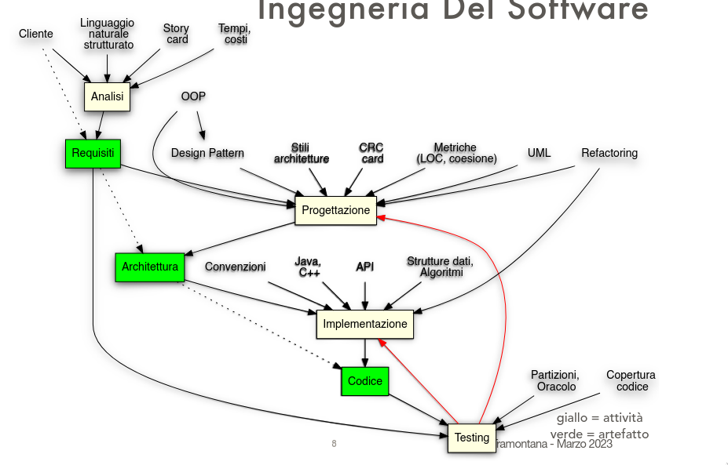

# 1 Lezione -- Ingegneria del Software

---

1. [Informazioni del corso](#informazioni-del-corso)
    1. [Libri consigliati](#libri-consigliati)
2. [Definizioni importanti](#definizioni-importanti)
    1. [Design Pattern](#definizione-di-design-pattern)
    2. [Processo di Sviluppo](#definizione-di-processo-di-sviluppo)
    3. [Refactoring](#definizione-di-refactoring) 
3. [Obiettivi della Software Engineering](#obiettivi)

---

## Informazioni del corso
* Linguaggio usato = Java

* https://www.dmi.unict.it/tramonta/se
* https://github.com/e-tramontana

* Test a risposta multipla, test a risposta aperta(implementare codice, disegnare UML), orale
    * Opzionale progetto da concordare (codice, UML, documentazione)

* Usare orario di ricevimento - (consiglio carta)

### Libri consigliati:
    * Sommerville, Ingegneria del Software/Software Engineering
        * Molto discorsivo 
    * UML Distilled Third Edition, Fowler
        * Faremo tutto. circa 200 pg
    * Designed Patterns: Elements of Reusable Object-Oriented Software
        * Qui ce ne sono molte (23) ne vedremo una quindicina
* Sul codice
    * Java 8 in action - Urma, Fusco, Mycroft
        * Libro di consultazione
    * Extreme Proramming Explained - Beck, Addison Wesley
        * Faremo tutto
    * Refactoring: Improving the design of existing code - 
        * Non lo faremo tutto, faremo circa una cinquantina di pagine, ma da tenere in considerazione
* Approfondimenti
    * Implementation Patterns - Beck 
        * Una serie di spiegazioni di basso livello
    * The Unified Modeling Language Reference Manual

Utile anche per consultazione futura

## Definizioni importanti

### Definizione di **Design pattern**:
    * una soluzione di progettazione per un problema ricorrente che riguarda un certo numero di oggetti che devono interagire fra loro. Deve essere documentata, sperimentata, ed essere ritenuta di successo. 

### Definizione di **Processo di Sviluppo**:
    * Indica una serie di attivita' che devono essere svolte durante lo sviluppo di un software. Chiarisce le attivita' che devono essere svolte e il loro ordine in base a come devono essere svolte. Ce ne sono tanti. Uno di questi si chiama Extreme Programming ed e' uno dei piu' utilizzati (Soprattutto in Nord Europa) 

### Definizione di **Refactoring**:
    * E' una tecnica che serve a migliorare la struttura del codice senza cambiare il comportamento del codice stesso.
    * Ad esempio, implementando un codice che implementa alcune istruzioni --> Dopodiche' se ci accorgiamo che abbiamo realizzato qualcosa di non molto efficiente, ad esempio nomi di variabili non buoni, allora cambiamo i nomi delle variabili rendendo piu' leggibile il codice. O se vediamo che abbiamo messo un ciclo inutile o utilizzare un altro metodo: La ricerca funziona ma il codice puo' essere migliorato. Quando miglioriamo senza cambiare il comportamento del codice stiamo facendo Refactoring. 

## Obiettivi

* Software Engineering serve per progetti di grandi dimensioni, che deve andare in produzione; si pensa e spera che siano anche software realizzati per avere una vita lunga --> E si continua a modificare e aggiungere features che vengono chieste e fare manutenzione

## Fasi dei processi di sviluppo:

### Analisi dei requisiti
Serve ad analizzare quali sono le modalita' che servono e che sono desiderate per il software.
    * Produce un documento dei requisiti. 
    * I requisiti sono l'elenco delle funzionalita' che un software deve avere
### Progettazione : OOP, Design Pattern, Refactoring
    * Capire quali parti servno all'interno del sistema software
    * Quali classi serviranno e come devono essere realizzate, come devono essere chiamate e che dati e funzionalita' debbano avere
    * Si fa uso della OOP, anche delle soluzioni ricorrenti della Design Pattern, e del Refactoring. 
### Implementazione
### Test  
    * Codice che mira ad eseguire il codice dell'applicazione per vedere se l'applicazione sta rispondendo come si vuole
    * Test: Serve a capire se l'applicazione esegue come si vuole, e dati certi input, si esegue una parte dell'applicazione, prendo il risultato e lo confronto con il risultato aspettato. Se c'e' una corrispondenza, il comportamento della applicazione va bene. In caso contrario l'applicazione deve essere modificata.
### Consegna
    * A questo punto e' finito lo sviluppo, ma continua la manutenzione
    * Possono ancora esserci bugs! Si lavora per risolvere problemi che possono capitare
    * Si previene diversi problemi che potrebbero esserci eseguendo ulteriori test 
    * Per sistemi softwares che non sono ad alto rischio! 
### Manutenzione
    * Aggiunta di nuove funzionalita' e rimozione di difetti, prevenzione dei bugs

### Esempio di processo di sviluppo: XP
Extreme Programming e' un processo di sviluppo, anche quello a cascata lo e'. Le fasi sono le stesse ma hanno terminologia diversa e si svolgono in maniera diversa. XP parla di pratiche, non di fasi.

### Concetti chiave
Baseremo sulla progettazione ad oggetti 
* Programmazione ad Oggetti --> Classi e relazioni fra classi 
RIUSO = Bisogna riusare quello che abbiamo gia' fatto. Se si progetta bene si possono realizzare parti di questo sistema che sono riutilizzabili. Questo va bene se si progetta con la programmazione ad oggetti --> Molta possibilita' di riuso, a differenza di una programmazione non orientata ad oggetti.  
UML = Usati molto per progettare 
JAVA = Uno dei linguaggi piu' utilizzati al mondo, e viene utilizzato in tantissime aziende per ingegneria del software  

A che serve in ogni caso sapere qual e' il linguaggio piu' utilizzato...?  

Servira' conoscere almeno altri linguaggi di programmazione: Perche' le aziende utilizzano una molteplicita' di linguaggi 

Molto utilizzato ad esempio il linguaggio Go  

---

pausa

---

## Sviluppo
* Potremmo pensare sia tipo Strutture dati + Algoritmi + Java, C++ + API => Implementazione => Codice
    
Ma e' poco adeguato e limitante per affrontare un progetto piu' grande

## Ingegneria del Software - Diagramma cronologico

* E' piu' complesso di cosi'... 
    * Mappa concettuale di IdS sulla struttura del processo di sviluppo

* Non decidiamo noi come fare -> Chiede il cliente -> Ci permette di affrontare la fase di analisi dei requisiti comunicando le necessita'
* Una volta che abbiamo la fase di analisi produrremo un documento dei requisiti che descrive dettagliatamente quello che il sistema software deve fare (Non in codice ma in linguaggio naturale / Italiano o inglese) 
* Per poter fare l'analisi dei requisiti bisogna: 
    * Conoscere bene un linguaggio naturale strutturato (inglese), e' strutturato perche' organizza in un formato che si riutilizza! Come se ci fossero dei campi da riempire. Format. Descrizione ma anche un test di validita', dati in ingresso. Campi predisposti.  
    * Story card = Uno strumento suggerito dal processo di sviluppo XP.
    * Tempi e Costi = Devo avere idea di come calcolarli. Non posso fare una cosa troppo in grande ne' piccola.

Dopo la produzione del documento dei requisiti si puo' dar vita alla progettazione. 
Progettazione, strumenti concettuali e pratici: 
    * Design Pattern
    * OOP
    * Stili architetture
    * Metriche
    * UML
    * Refactoring

Dalla progettazione deriva come sara' l'architettura del software. L'architettura del software puo' essere dettagliata o astratta. Se ci si spinge verso la conclusione della progettazione sara' piu' esaustiva e dettagliata. Se e' ancora in forma iniziale sara' piu' astratta. In ogni caso documenti utili. 

Adesso si affronta la fase di implementazione
    * Architettura software
    * Convenzioni sul codice! E' bene scriverli in un certo modo anche per poterlo leggere facilmente per se' e per altri! 
        * Dove metto la parentesi graffa? Come metto i commenti? Come uso le maiuscole? Camel case o snake case?  
    * Linguaggi di programmazione
    * API
    * Strutture dati e Algoritmi 

Test: Cosi' mi accorgo se il codice e' quello che mi aspettavo. Il test mira a valutare se il sistema software esegue in maniera corretta o meno. Si prende il risultato e lo confronto con qualcosa: se c'e' una corrispondenza bene, altrimenti non e' corretto.  
Con cosa lo confronto? Il risultato che viene dato? Bisogna saperlo a monte. Un documento dei requisiti fatto bene contiene queste informazioni! Su come, ad esempio, fare le ricerche, se e' un motore di ricerca.  
"Se non ho corrispondenza in questa maniera che risultato dare? Lista vuota, errore, false, primo elemento della lista? Cosa fare?"  
Sono tutti risultati possibili. Dobbiamo capire quale risultato scegliere. Un documento dei requisiti scritto bene ha queste info.  
Quando il test e' corretto non lo decide chi fa il test ma chi fa il documento dei Requisiti. Se chi progetta i test si accorge che il documento dei requisiti e' incompleto bisogna completarlo.  
Chi realizza software di grandi dimensioni si deve porre problemi di questo tipo e considerare che ci saranno tante persone che collaboreranno al progetto 
Bisogna determinare nomi delle operazioni delle classi, attributi, tipo di attributi e parametri sia in ingresso che uscita, allora ho una programmazione dettagliata. 
Descrizione dettagliata dei componenti, assieme alle relazioni tra le classi --> Serve farlo bene ed e' ancora progettazione e non codice 
Chi si occupa di implementazione ha gia' nome della classe, nome dei metodi, tipo di parametri in ingresso e uscita e tutto. Deve appunto implementarli.  
L'alternarsi tra le varie fasi dipende dal tipo processo di sviluppo!  
    *  A cascata = fai tutta la progettazione e poi la codifica, non fare progettazione durante la codifica e non fare codifica durante la progettazione
    * XP = permette di alternare le fasi
 
Qui quando si parla di architettura e' solo software: non ci si riferisce a hardware ne' SO.  

### Caratteristiche del software

E' un prodotto delle attivita' umane diverso dagli altri: non e' materiale. (E la musica?) Ha caratteristiche diverse rispetto a tutti gli altri --> Modificabilita'. E' piuttosto facile modificarlo. Cio' viene a vantaggio di chi lo produce. L'azienda fa un investimento --> Permette di pagare investimento anche piu' volte. Se e' facile modificare allora in maniera piu' veloce posso sviluppare un nuovo sistema software diverso ma con un costo minore (E' come una orchestra!!)  
Come programmatori possiamo prendere delle decisioni in modo da rendere il software piu' facile da modificare.  

Se un cliente si trova bene allora continua a usarlo: nel frattempo l'hardware e le periferiche e le cose cambiano. Agli sviluppatori viene chiesto di inserire features in base ai cambiamenti. L'hardware diverso che viene prodotto spinge alla modifica del prodotto con cui l'utente si trovi bene. Se l'utente si trova male allora cambiera' anche software. Un software di successo e' adattabile.  
Possono anche cambiare le leggi della societa', ad esempio la privacy o le tasse o fattori legislativi diversi.  

### Qualita' del codice

* Definizione di qualita' software
    * Valutiamo inanzitutto la correttezza. Se non si comporta in maniera corretta non e' di qualita'
        * Valutiamo la correttezza in base a quanto si adatta alle specifiche e ai requisiti, ovvero conforme alle specifiche. Si comporta come ci avevano detto? 
    * Se qualcuno non da' il documento della specifica dei requisiti allora non posso valutare i requisiti. 
    * Magari posso valutare che le specifiche sono corrette ma non e' quello che vuole il cliente! 
        * Ovvero, non abbiamo capito quello che il cliente voleva, lo stiamo capendo troppo tardi, e il sistema software e' corretto ma "inutile", ad esempio il cliente ci dice che ha Apple e noi creiamo qualcosa che funziona su ChromeOS
    * Il documento dei requisiti in grandi progetti deve essere firmato dal cliente. Se il software e' corretto e il cliente dice di no e se il cliente ha firmato --> Allora il problema e' del cliente...
    
* Efficienza, manutenibilita', Dependability (sicurezza e affidabilita'), usabilita' 
    * Efficiente = usa una quantita' di memoria e CPU giusto per quello che gli sto dicendo di fare. Non usa eccessivamente memoria o rete. C'e' una corrispondenza giusta di sfruttamento di risorse. 
    * Manutenibilita' = e' facile effettuare manutenzione sul codice e modificarlo 
    * Dependability = sicurezza e affidabilita'.
        * Sicurezza = Security e Safety
            * Security = Stiamo proteggendo i dati che devono essere protetti in maniera adeguata? Crittografia, permessi di accesso, autorizzazione
            * Safety = Il sistema software sta eseguendo in maniera tale da non mettere in rischio la vita delle persone? Esempi sono tantissimi. automobili, aerei, la Nasa, strumenti medici, ETC. Ci sono anche sistemi in cui la tempistica e' importante = In Real Time 
        *  Affidabilita' = quanti guasti nel tempo provoca il sistema? La si misura valutando l'esecuzione del sistema su TANTI campioni.

 
