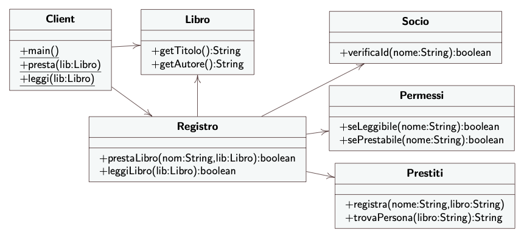

# 11 Lezione -- Ingegneria del Software

---

<!-- TOC -->
- [Esercitazione Facade -- Biblioteca](#esercitazione-facade----biblioteca)
    - [Dettagli implementativi](#dettagli-implementativi)
- [**Design Pattern State**](#design-pattern-state)
    - [Soluzione DP. State](#soluzione-dp-state)
    - [Conseguenze:](#conseguenze)
    - [Diagramma degli stati UML](#diagramma-degli-stati-uml)
<!-- /TOC -->

---

## Esercitazione Facade -- Biblioteca 

[Codice della biblioteca](https://www.dmi.unict.it/tramonta/se/oop/appLibri.html)



In questo caso la classe registro funge da Facade del Client rispetto alle sottoclassi.  

### Dettagli implementativi 

* Realizzazione e implementazione delle classi 

**Nota**: in questo caso abbiamo inserito i nomi dei soci e dei libri tramite hardcoding perche' e' un esempio semplice ma in qualcosa di serio saranno inseriti tramite file.  

**Nota**: tipo MAP e List e i loro metodi. Servono. ```containsKey``` vs ```contains```, ```put```, ```add```, ```get```, ```KeySet```.  

Registrare prestiti passando nome socio e titolo del libro + trovare persona che ha in prestito un certo libro.  
  
La classe registro implementa il facade.  
Considerare il fatto che Registro abbia al suo interno le istanze private di Permessi, Socio, e Prestiti.  
  
Non passiamo queste istanze al costruttore. Il facade le contiene.  
  
il facade Registro conosce le varie classi del sottosistema e sa quali funzioni chiamare su esse per realizzare il sottosistema.  
  
opt: notazione del diagramma di frequenza che vuol dire "queste chiamate sono opzionali: possono avvenire o meno in base al codice e cio' che e' inserito.  
  
---

## **Design Pattern State** 

Design Pattern Comportamentale/Behavioural

Fornisce un modo per avere un oggetto che altera il comportamento in base allo stato. Ma far si' che sia talmente diverso che sembri che l'oggetto abbia cambiato la sua classe.  
La classe in effetti cambia, ma il client non si deve accorgere del cambiamento.  

*Esempio: modalita' online/collegato alla rete, modalita' offline/scollegato dalla rete, modalita' di emergenza*

Si puo' adottare se abbiamo un oggetto con uno stato del sistema --> Nella oop uno stato e' un valore all'interno di certi attributi, quindi lo stato e' quel particolare insieme di valori che fornisco agli attributi in un certo momento. Ogni insieme di valori che fornisco agli attributi da' uno stato che cambia nel tempo.  

Domanda: ho un comportamento per quell'oggetto che deve essere sufficientemente diverso per lo stato in cui e'? Vuol dire mettere del codice che dipende dallo stato.  
  
Seconda verifica: Consiste nel valutare se per l'oggetto che sto verificando posso individuare degli stati diversi fra di loro e il codice che inserisco per i vari stati e' diverso fra di loro.  
  
Esempio: Un attributo valore intero e glielo metto in x. Il codice che metto dipende da x --> La formula dipende da x. Ma la formula e' uguale per il valore di x.  ? 

Altro esempio: avendo una variabile, e all'interno del codice metto una valutazione di x, che se x e' vero allora fai questo, scrivi sul database etc. Altrimenti fai un'altra cosa, chiama metodo, etc. Il comportamento nel primo caso e' molto diverso dall'implementazione del secondo. Primo stato: x=true, secondo x=false. Il comportamento dei due stati costringe a scrivere del codice condizionale. Varia tanto che si eseguono proprio delle istruzioni diverse.  
  
L'oggetto dipende da uno stato -> e questo stato induce a implementare comportamenti diversi in base ad esso. Codice diverso da eseguire in modalita' aut-aut. Se questa e' la casistica allora, senza il design pattern state avrei bisogno di fare del condizionale. Spesso rappresento lo stato tramite una variabile.  
  
Eseguendo il codice si va su uno dei rami condizionali che fa si' che il comportamento a runtime sia diverso per ogni stato.  Spesso servirebbe avere il controllo dello stato per ogni operazione implementata all'interno dell'oggetto. Ma il design pattern state risolve questa cosa.  
  
### Soluzione DP. State  

Inserire ogni ramo condizionale in una classe separata.  
I ```ConcreteState``` sono le sottoclassi che implementano ciascuna il complemento associato ad uno stato del Context, overriding the functions rispetto allo stato in cui sono.  
Isoliamo ogni metodo nella interfaccia state e implementiamo ciascuna nel proprio stato.  
  
* C'e' anche un'altra cosa che dobbiamo fare: una classe di interfaccia tra la interfaccia State e il client, che si chiama Context. Essa ha un attributo State che contiene al suo interno una istanza a runtime di tipo ConcreteState.  
State qui sara' una interfaccia i cui metodi saranno overridden by its sottoclassi.  
Context serve anche a **cambiare lo stato**.  

* **La freccia con rombo in UML si chiama Aggregazione** --> distinzione che facciamo a livello di progettazione A frecciarombo B = come codice non distinguiamo ma come progettazione distinguiamo dicendo che aggregazione sta dando all'oggetto che aggrega (A) un comportamento che dipende dagli oggetti aggregati, e A non sta aggiungendo tanto.  
  
Piu' spesso tuttavia non ci sono motivi di mettere aggregazione e preferiamo **associazione**. (frecce). Non abusare il concetto di aggreazione. Aggregazione vuol dire che A fa solamente chiamate su B e non aggiunge quasi niente di suo. MEGLIO usare associazione.  

L'elenco dei metodi che mette a disposizione il context e' diverso dall'interfaccia. L'interfaccia del context deve essere diversa dal context.  

Il metodo definito da state e' ```handle()```, il metodo implementato da Context e' ```request()```.  
  
* Se i dati che servono nel concrete state A servono solo a ConcreteStateA allora quando finisce finisce.  
SE servono ad altre parti e' metterli dentro il context. Ci sono un insieme di dati che servono a piu' ConcreteState allora sara' messo in Context e sara' passato a ConcreteStateA e ConcreteStateB etc. Se viene modificato dalle sottoclassi allora il ConcreteState si deve occupare di modificare lo stato che e' in Context (in uscita.) Per fare questo possiamo passare l'istanza di Context al concrete state per dargli i dati che gli servono.  
  
Il context definisce i metodi che il client puo' invocare.  
  
* **Il client ne' altre classi esterne possono conoscere ne' invocare i metodi o le istanze dei ConcreteState.**

I vari concretestates li istanzia e li conosce il context E BASTA.  Il context si occupa della loro istanziazione.  
  
Solo Context conosce il nome della classe. Se lo vuole cambiare non si propaga da nessuna parte perche' questi nomi NON saranno conosciuti dalle altre classi.  

Il bello del DP State e' che non abbiamo bisogno di una variabile numerativa o booleana da controllare perche' ci basta sapere in che istanza di ConcreteState siamo (Attributo di tipo state). 
Client la chiede al Context, il Context lo chiede al Concrete State.  

Una versione: il context sceglie quando e' il momento di cambiare stato o per conto suo o perche' riceve una chiamata.  Oppure potremmo far decidere il cambiamento dello stato ai ConcreteStates. In ogni caso, la variabile che tiene lo stato e' sempre dentro context, il quale mette a disposizione un metodo per il cambiamento di stato.  
  
### Conseguenze: 

Abbiamo diviso e incapsulato il comportamento necessario rispetto agli stati in sottoclassi diverse invece di usare rami di scelta condizionata. Sono piu' facili da leggere e da modificare. La parte di codice che decide il cambiamento di stato lo mettiamo dentro Context, che quando viene invocato il metodo inizializza o re-inizializza in base allo stato in cui siamo. Separata dall'algoritmo che implementa il comportamento in quello stato.  
--> Conseguenza: codice piu' semplice da leggere e piu' pulito.  
  
Il codice condizionale dentro context --> piu' facile da capire se siamo nello stato giusto. Se succede questo, istanzia questo concrete state, altrimenti quest'altro. Riesco a capire se ci sono o non ci sono delle situazioni in cui istanzio una dei concrete states.  
  
Posso eseguire il cambiamento di stato piu' semplicemente e velocemente.  

* Conseguenza: potrei avere un gran numero di ConcreteStates da implementare, PERO' esse sono semplici. Avere un numero maggiore di classi potrebbe non essere uno svantaggio proprio perche' sono piu' semplici.  

* Ho tolto le condizioni dai concrete states.  
1. Le istruzioni condizionali sono state ridotte, ne' ce n'e' all'interno dei ConcreteStates. 
2. Capisco all'interno dei Context se sono nello state giusto.  
  
### Diagramma degli stati UML

--> per tenere traccia di essi.  Uno stato individuato e' una particolare combinazione di valori che faccia in modo che il comportamento di un oggetto cambi.  
* Uno stato e' un triangolo con gli angoli arrotondati nel diagramma di stati UML 
* Attenzione a disegnare bene il simbolo dello stato perche' SOLO gli angoli devono essere arrotondati, NON i lati tondi perche' quello ha un altro significato.  

Se c'e' uno stato iniziale lo indichiamo nel diagramma con un pallino nero colorato con una freccia verso lo stato (NON e' uno stato in se', indica solamente quale e' quello di partenza.)  
  
Oltre a questo dobbiamo anche individuare le transizioni tra uno stato e l'altro.  --> Con una freccia che va da uno stato all'altro con una etichetta (notazione) che indica l'evento che scatena la transizione, che si chiama **Evento**. (condensato, scriviamo da qualche parte che cosa effettivamente implichi l'evento)  
  
Ragionando sui requisiti bisogna individuare le transizioni corrette che devo consentire tra gli stati.  
  

  
