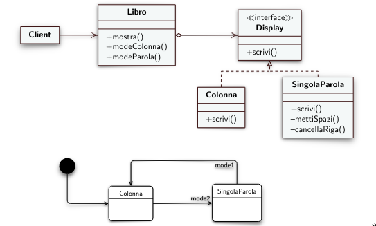

# 12 Lezione -- Ingegneria del Software

---

<!-- TOC -->
- [Recap sul Design Pattern State](#recap-sul-design-pattern-state)
    - [Analisi codice e cose da ricordare](#analisi-codice-e-cose-da-ricordare)
- [Dall'Analisi dei Requisiti alla Implementazione](#dallanalisi-dei-requisiti-alla-implementazione)
    - [Analisi del diagramma degli stati](#analisi-del-diagramma-degli-stati)
    - [Design Pattern State Analysis](#design-pattern-state-analysis)
<!-- /TOC -->

---

## Recap sul Design Pattern State




Esempio: Display testo in diversi modi: Colonna o Singola Parola.  es: Dispositivo Smartwatch  

L'interfaccia State viene implementata da Colonna e SingolaParola --> il metodo pubblico che prima era "Handle" viene implementato in ogni sottoclasse. In una delle sottoclassi abbiamo anche dei metodi privati (ad esempio in Singola Parola)  
  
In questo caso per cambiare modalita', in context esistono due metodi che permettono al client di scegliere la visualizzazione (non viola il concetto di "client che non puo' conoscere le sottoclassi" perche' il client non conosce tutto il resto, e si occupa di tutto il Context)  
  
```private List<String> lista = Arrays.asList(testo.split("[\\s+]+"));```
per splittare sugli spazi, diverso da splittare con il carattere spazio. Restituisce un array di stringhe dove ogni cella dell'array contiene una parola. NON restituisce una lista. Quindi convertiamo un array in una lista con ```asList``` che trasforma un array in una lista  

### Analisi codice e cose da ricordare

1. Metodi da invocare su String. ```.lenght()```, ```.repeat()```
2. Metodi delle liste, ```get()``` ```put()``` ```add()``` 
3. FARE metodi privati anche piccoli per rendere piu' chiaro l'algoritmo di partenza, come ```mettiSpazi(int n )``` e ```cancellaRiga()```. Bisogna isolare le piccole parti per rendere il codice piu' leggibile.  

Il DP State ci evita di fare rami condizionali complessi semplificando tutto. Possiamo eliminare i costrutti condizionali tramite questo Design Pattern.  

Tra un po' vedremo che possiamo eliminare anche il ciclo for.  

---

## Dall'Analisi dei Requisiti alla Implementazione  
  
Bisogna **analizzare tutti i dati** che servono per poter costruire il codice; dovrebbero avere i dettagli che servono per l'implementazione.  
  
Su come raccogliere i requisiti ne parliamo prossima volta con i processi di sviluppo e le fasi.  

La prima cosa e' fare una **progettazione** ad oggetti. Individuare le classi che possono essere utili per la progettazione di questi requisiti.  
  
Un buon metodo e' fare la **analisi grammaticale** dei requisiti. I sostantivi possono indicare classi o attributi, i verbi possono indicare metodi.  

I requisiti sono fatti bene se **si usano i verbi "Dovra'" / "Dovrebbe"**. Non verbi come "potrebbe".  
  
Il verbo avere --> indice di qualcosa che ha un attributo / qualcosa che contiene qualcos'altro.  
  
[ ... ]

### Analisi del diagramma degli stati 

entry --> Passaggio dentro lo stato e l'operazione che facciamo quando entriamo in esso.  
  
per due stati si specifica l'operazione da compiere per entrare in quello stato (entry/intesta, entry/salda).  
  
entry / do / exit --> Parole chiave di questi stati.  
  
**entry**: cosa da fare all'inizio ogni volta
**do**: cosa che quando si e' in quello stato si puo' fare.  
**exit**: qualcosa che deve essere fatta subito prima dell'uscita dallo stato.  
  
Prima versione del codice con molti branch condizionale 
  
* Idea: contare righe per punti e virgole  

* Idea: **Replace Conditional with Polymorphism** ovvero sostituire rami condizionali con il polimorfismo (e il design pattern state) --> ovvero **Replace Type Code with State**.  
  
### Design Pattern State Analysis

La sottoclasse disponibile conosce lo stato di bloccato, ne conosce l'esistenza (e la istanzia?) e puoi' far in modo di passare da se' ad essa.  
  
* **Possibile domanda di esame** --> trasformare un codice sequenziale e con rami condizionali in una implementazione corretta di un design pattern state.  
  
* **NOTA** --> Possibilita' di restituire uno stato diverso rispetto a quello in cui ero prima.  
  
* Nota: l'istruzione  
    ```return new Bloccato().intesta(s);```
e' equivalente (?) a   
```java
State biglietto sb1, sb2;
sb1 = new Bloccato();
sb2 = sb1.intesta(s);
return sb2;
```

[ .... oops]