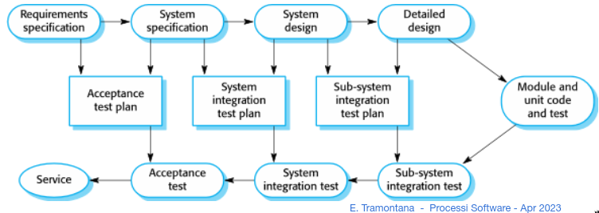
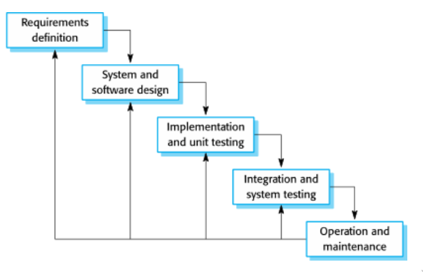

# 15 Lezione -- Ingegneria del Software

---

<!-- TOC -->
- [Fase di Test -- Cont'd](#fase-di-test----contd)
    - [Test di componenti/unita'](#test-di-componentiunita)
    - [Test di Sistema](#test-di-sistema)
    - [Test di accettazione](#test-di-accettazione)
        - [Difficolta' raccolta requisiti](#difficolta-raccolta-requisiti)
    - [Beta Test](#beta-test)
    - [Versione Gold](#versione-gold)
- [Manutenzione / Evoluzione:](#manutenzione--evoluzione)
- [Quadro riassuntivo di sviluppo](#quadro-riassuntivo-di-sviluppo)
- [Processo di sviluppo a Cascata](#processo-di-sviluppo-a-cascata)
    - [Punti di forza](#punti-di-forza)
    - [Punti di debolezza](#punti-di-debolezza)
- [Processo Evolutivo](#processo-evolutivo)
    - [Sviluppo per Esplorazione](#sviluppo-per-esplorazione)
    - [Sviluppo Build and Fix](#sviluppo-build-and-fix)
- [Altri Processi di sviluppo](#altri-processi-di-sviluppo)
    - [Processo di sviluppo incrementale](#processo-di-sviluppo-incrementale)
    - [Processo CBSE (Component-Based Software Engineering)](#processo-cbse-component-based-software-engineering)
- [Processo di sviluppo a Spirale](#processo-di-sviluppo-a-spirale)
    - [Determinazione obbiettivi](#determinazione-obbiettivi)
    - [Valutazione dei rischi](#valutazione-dei-rischi)
    - [Produzione](#produzione)
    - [Pianificazione](#pianificazione)
<!-- /TOC -->

---

## Fase di Test -- Cont'd  

### Test di componenti/unita' 
Si testano i singoli componenti indipendentemente: I metodi, non le classi.  
  
Sviluppati dai singoli programmatori delle classi.

La classe di test conterra' tante chiamate e test diversi per i singoli metodi.  
  
Classe di test: avra' tanti metodi come la classe da testare e pensiamo un metodo di test per ogni metodo dell'applicazione.  
  
Idea: JUnit, librerie di supporto per sviluppare i test delle classi.  
  
### Test di Sistema
Dopo aver realizzato tante classi testate indipendentemente esse vengono assemblate e si ha un sistema piu' integrato e si valuta se si comporta come volevamo --> Funzioni di alto livello piu' complesse tra di loro.  
  
Mira a valutare la correttezza organica del sistema.  
  
Ci si occupa di questi test a parte rispetto ai test singoli. Fatti da persone qualificate per questo.  
  
### Test di accettazione 
Detta versione Alpha.  
Si testa con dati offerti o chiesti dal cliente. L'etica degli sviluppatori deve guidarli a non divulgare i dati del cliente (dovrebbero essere privati). (🤔) 
  
#### Difficolta' raccolta requisiti
Quando qualcuno ci chiede di fare un software o il capo che ci dice di aggiornare come il software funziona etc. --> Qualcuno deve cambiare ruolo o essere licenziato (infami) forse, in modo che la azienda (si spera) funzioni meglio.  

Le aziende potrebbero essere restie a dare delle informazioni. La difficolta' di chi raccoglie requisiti e' capire se le informazioni che ci sono state date sono complete, veritiere...   
Perche' chi offre queste informazioni ha la (fondata) paura che dicendo tutto il software potra' sostituire delle mansioni o cambiare l'azienda e le persone verranno licenziate.  
  
Non e' immediatamente palese se le informazioni sono giuste e consone anche perche' i programmatori non sono immediatamente esperte nel campo in cui il codice viene prodotto.  
  
E' un problema sociologico e problema di ingegneria del software. E del capitalismo  
  
### Beta Test  
  
Fatto dai clienti stessi che potrebbero mostrare errori a cui non avevamo pensato  
  
### Versione Gold  
Versione finale detta anche "versione gold"   
  
## Manutenzione / Evoluzione:  
  
Il software puo' cambiare, magari cambia l'hardware, cambiano dei requisiti, il software deve cambiare ed evolvere.  

Evoluzione: cambiamento del software
Manutenzione: cambiamento del software + piu' cose. Rimuovere da vecchi hardware e bugfixing 

---

## Quadro riassuntivo di sviluppo  
  

  
Possono essere regolate in maniera diversa, quanto tempo dedicare alle fasi, quando fermare i test. Una parte del team di sviluppo si occupera' di pianificare il lavoro.  
  
Ogni processo di sviluppo organizza in maniera diversa tutto questo.  
  
--- 

## Processo di sviluppo a Cascata  
  

  
Royce - 1970  
  
In cui ogni fase bisogna condurla dall'inizio fino al suo completamento. Inizia con la prima fase dei requisiti e continuerai a fare solo raccolta dei requisiti fino a quando non avrai un documento finale su cui tutti (Tutti gli **Stakeholders** ovvero chi ha voce in capitolo sul software in questione)sono d'accordo.  
  
Se nella fase di progettazione ci accorgiamo che il documento ha lacune NON possiamo tornare indietro, ma dobbiamo andare avanti per completare la fase di progettazione.  
  
Anche li', se nella fase di codifica ci rendiamo conto di lacune nella fase di analisi requisiti o progettazione, non possiamo tornare indietro. Quando implementiamo l'implementabile, passiamo alla fase dopo.  
  
Solo alla fine, nella fase di manutenzione, torniamo indietro se abbiamo trovato degli errori o se qualcosa (progettazione, requisiti etc) erano incompleti. Solo alla fine torniamo indietro in uno dei punti precedenti.  
  
### Punti di forza 
Documentazione di tutto in maniera scritta e chiara. Viene tenuta traccia bene di quali sono le decisioni a livello di tutte le fasi.  
  
E dato che non possiamo tornare indietro, tra i documenti della cascata ci sara' tantissima consistenza. (Requisiti -> Progettazione).  
  
Se invece durante la progettazione tornassimo indietro dovessimo cambiare e modificare i requisiti, poi nella progettazione bisogna cambiare tutti i requisiti. Casino perche' bisogna rileggere tutti i requisiti.  
  
Ampia fase di test! --> Software di qualita'
  
### Punti di debolezza
  
Ci vuole molto tempo per sviluppare con questo processo di sviluppo. Per software grandi circa un anno. Ogni fase ha bisogno del suo tempo.  

Perche' e' un problema? Non e' proprio perche' il cliente vuole le cose subito.   
  
Il vero problema e' che, se i requisiti possono cambiare all'interno dell'anno e del tempo e' un problema. Magari cambia la legge o cambia dell'hardware.  
  
Esempio: magari e' un aereo. C'e' un ciclo di progettazione molto lungo. Se le aziende decidono di adottare un hardware quello rimane tale per molto tempo. Una volta che e' stata scelta una certa cosa per un aereo abbiamo tempo di utilizzare l'hardware bene per quello.  
  
In genere le persone che si occupano di implementazione sono di piu'.  
  
Parliamo con il cliente solo durante la fase iniziale (poca interazione con il cliente).  
  
Usato di solito con team ampi (almeno un centinaio di persone).  
  
## Processo Evolutivo
Poco tempo, poca documentazione.  
Se per esempio il cliente non e' molto preciso nei suoi requisiti.  
I requisiti potrebbero essere chiari in alcuni casi e nebulosi in altri e capiamo gia' che non sono completi.  
  
### Sviluppo per Esplorazione

Il modo migliore e' mostrargli via via nuove versioni del sistema software. Prendiamo i requsiti che sembrano piu' chiari e lo trasformiamo in sistema software. Facendo una progettazione minimale, implementando, etc. Sappiamo gia' che il sistema non e' completo e che i requisiti possono essere aggiornati. Se il cliente dice si' allora bene e noi abbiamo gia' una parte e poi ci concentriamo sulla prossima parte e magari il cliente ha le idee piu' chiare.  
  
Andiamo mano mano per cambiamenti.  
Rendiamo chiaro al cliente che (dato che non c'e' un contratto fisso da firmare) gli portiamo delle versioni e il cliente quindi deve pagare per il tempo su cui lavoriamo. Impegno degli sviluppatori di creare versioni da portare al cliente, e del cliente di pagare gli sviluppatori.  
  
### Sviluppo Build and Fix
Ancora piu' alla cieca rispetto a prima. 
Qui i requisiti non li abbiamo proprio. Comprensione limitata del sistema di partenza. Il cliente potrebbe essere anche mai soddisfatto. Ad ogni versione ci si chiede anche se vale la pena andare avanti. Se ognuna delle due parti non capisce l'altra ma c'e' una fiducia e delle ore di lavoro da pagare bene. Se invece non c'e' fiducia e il cliente e' convinto che e' lo sviluppatore che non capisce e si rifiuta di pagare allora si abbandona il progetto.  
Non e' solo una questione di venire pagati ma anche di soddisfare le richieste. --> Se capiamo per esempio che entro i tot mesi che ci ha dato NON arriveremo a completare il progetto.  

--- 

## Altri Processi di sviluppo  
  
### Processo di sviluppo incrementale  

Implementate le funzioni di base -> Funzioni integrate fra di loro a mano a mano che si costruisce. Non vengono date informazioni molto dettagliate.  
Il processo di sviluppo XP utilizza una parte del processo di sviluppo incrementale e anche quello a spirale. Assume un significato piu' specifico in base a dove lo utilizziamo  
  
### Processo CBSE (Component-Based Software Engineering)
O basato su COTS (Componenti esistenti (Components Off The Shelf))  
Tenta di usare componenti gia' esistenti / codice gia' realizzato. Non sempre fa quello che vogliamo, bisogna adattarlo e riconfigurarlo. Lo sforzo qui e' riadattare a quello che serve.  
Chi adotta questo processo si occupa di integrare cio' che esiste gia': Si potrebbe anche evitare di integrare componenti diversi ma pilotandoli da qualche file di configurazione.  
Magari: proposta al cliente della modifica dei requisiti in base ai componenti che abbiamo per riadattare di meno.  

---

## Processo di sviluppo a Spirale
Di tipo incrementale / Evolutivo.  
Si parte dal centro della spirale e si attraversano i quattro assi cartesiani. Ogni quadrante individua delle attivita' che effettuiamo durante lo sviluppo del processo.  
La **prima attivita**' e cosa da fare e' determinare gli obbiettivi del ciclo/spirale che stiamo facendo. Quali sono gli obbiettivi del completamento di questo ciclo?  
Il **secondo quadrante** cerca di valutare i rischi. Determiniamo quali eventi avversi possono determinarsi e valutare una probabilita' del rischio e cosa succede se avviene --> cosa possiamo mettere come aggiustamento se cio' avviene. 
1--> Cosa avviene di negativo  
2-->La probabilita' che avvenga  
3-->Che effetto ha  
4-->Come possiamo correggerlo.  
  
Nel **terzo quadrante** produciamo qualcosa
Nel **quarto quadrante** (ultimo) pianifichiamo le prossime attivita'.  
  
Ogni ciclo a spirale dura molto. Anche 1 anno, due anni. Sembra che i prodotti Microsoft seguano questo tipo di processo a sviluppo.  
A volte viene chiamato meta-processo perche' all'interno posso adottare processi a cascata. O un ciclo della spirale lo posso fare in maniera esplorativa.  
  
All'inizio di ogni ciclo decidiamo un obbiettivo: di cosa ci occupiamo al prossimo.  
Quello che facciamo nella fase di produzione dipende dagli obbiettivi che ci siamo posti nella prima fase.  
  
Puo' essere che ogni ciclo faccia una delle fasi dei progetti di sviluppo; assomiglia al progetto a cascata ma aggiungiamo delle cose. Ad ogni ciclo ci sono degli assessments. Non progettiamo tutto all'inizio, ma prendiamo delle decisioni man mano ad ogni ciclo.  
  
Tecnicamente sono categorizzabili nei processi "agile/agili" ma dipende. Se un ciclo della spirale dura tanto allora e' poco agile pero'. Dipende dalla durata.  

### Determinazione obbiettivi

Stabiliamo gli obbiettivi rispetto a dove siamo: Magari all'inizio avere una idea dei requisiti, cont uttte le ripercussioni del caso. 

### Valutazione dei rischi

--> Per quegli obbiettivi per quali sono i rischi? Quali azioni mitigano questi rischi?

Si fa periodicamente. Ogni tot nel ciclo bisogna fare questa valutazione --> Soprattutto se il ciclo totale dura tanto tempo. 

Uno dei rischi potrebbe essere usare una libreria out-dated.  --> Cercare una evenienza
  
Altro tipo di rischio: se le persone piu' esperte in questa cosa se ne vanno dall'azienda? Quanto e' rischioso che se ne vadano? Come faccio in modo a farle rimanere? Aumento lo stipendio magari... O altre cose. E cosa fare nell'evenienza.  
  
### Produzione
Metterci al lavoro per applicare gli obbiettivi

### Pianificazione 
Valutare cosa fare nella prossima fase.